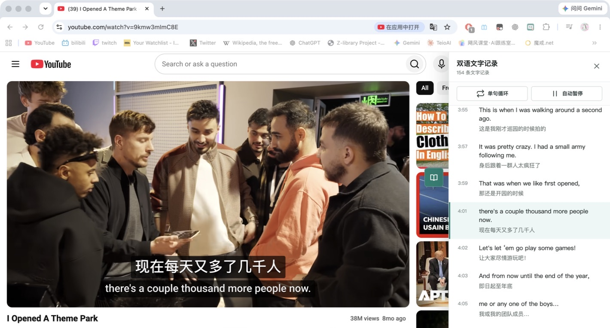

# YouTube 双字幕 / YouTube Dual Subtitles

一个 Chrome-only 的 Manifest V3 扩展，在 YouTube 播放器中显示英文与简体中文双字幕，并提供字号、位置、背景和字幕记录等学习辅助功能。

This is a Chrome-only Manifest V3 extension that displays English and Simplified Chinese captions together in the YouTube player, with controls for size, position, background, and transcript-oriented study tools.

本项目不是 YouTube 或 Google 的官方产品，也不代表 YouTube 或 Google。YouTube 是其各自所有者的商标。

This project is not an official YouTube or Google product and is not endorsed by either company. YouTube is a trademark of its respective owner.

> **公开测试版 / Public beta**
>
> `2.0.0` 是面向 macOS 与 Windows 桌面版 Chrome 的公开测试版。它不会承诺在 100% 的 YouTube 视频上成功显示双字幕。YouTube 字幕可用性、自动翻译、页面状态、本地模型下载、播放器音频捕获和设备性能都会影响结果。若扩展在页面切换或重新加载后暂时失效，可先完整刷新 YouTube 页面；偶尔需要刷新多次。请通过 GitHub Issues 提交可复现的视频链接、Chrome/操作系统版本和错误现象。
>
> `2.0.0` is a public beta for desktop Chrome on macOS and Windows. It does **not** promise bilingual captions on 100% of YouTube videos. YouTube caption availability, automatic translation, page state, local-model downloads, player audio capture, and device performance can all affect the result. If the extension temporarily stops responding after navigation or an extension reload, fully refresh the YouTube page; an occasional second refresh may be necessary. Please report reproducible cases through GitHub Issues with the video URL, Chrome/OS version, and observed behavior.
>
> **字幕来源说明：**如果视频本身同时提供可用的英文和简体中文字幕，扩展可以直接组合显示，这是最稳定的路径。如果视频没有同时提供两种字幕，扩展会在用户开启“本地识别”后尝试使用本地识别和机器翻译补全；此回退无法保证成功显示，也无法保证识别或翻译准确性。
>
> **Caption-source notice:** If a video already supplies usable English and Simplified Chinese caption tracks, the extension can combine them directly; this is the most reliable path. If both tracks are not supplied, the extension can attempt local recognition and machine translation after the user enables “Local recognition.” This fallback does not guarantee that captions will appear or that recognition and translation will be accurate.

## 演示 / Demo



画面展示播放器内中英双字幕、双语文字记录、点击时间跳转、单句循环和自动暂停。视频画面与字幕仅用于扩展功能演示，相关内容归原权利人所有。

The screenshot shows bilingual captions in the player, the bilingual transcript, timestamp seeking, sentence looping, and auto-pause. Video imagery and caption content are shown only to demonstrate the extension UI and remain the property of their respective owners.

## 功能范围 / Features

- 中英双字幕：优先使用可用的原生字幕；必要时请求 YouTube 提供的简体中文翻译。
- 双字幕显示：可调整字号、位置和背景透明度。
- 单语回退：只有一种可用语言时，保留该语言字幕，不伪造另一种语言。
- 本地识别（实验性）：只有英文字幕时优先在浏览器内用本地英译中模型补出中文；没有可用文字字幕时，再捕获播放器音频运行本地 Whisper 和英译中模型。
- 学习辅助：提供字幕记录、定位和跟读相关的界面能力，具体可用性取决于视频与字幕数据。
- 原生字幕保护：扩展无法取得字幕时，不应阻止 YouTube 自身字幕继续工作。

- Bilingual captions: prefers available native tracks and can request Simplified Chinese translation supplied by YouTube when needed.
- Display controls: adjust caption size, position, and background opacity.
- Single-language fallback: keeps the available language instead of inventing a second translation.
- Local recognition (experimental): when only English captions exist, each user's browser first runs a local English-to-Chinese model; when no usable text captions exist, it captures player audio and runs local Whisper plus translation.
- Study helpers: includes transcript, seeking, and shadowing-oriented UI where the video and caption data allow it.
- Native-caption fallback: the extension should not hide YouTube captions when its own caption path is unavailable.

## 支持范围 / Support

当前目标支持范围是 macOS 和 Windows 上的桌面版 Google Chrome 中的 `https://www.youtube.com/*` 页面。两端使用同一个扩展包，但不同 Chrome 版本、系统和硬件仍可能表现不同；测试版发布不代表所有组合均已验收。Firefox、Safari、Edge、其他 Chromium 浏览器、移动端 YouTube、嵌入式播放器和其他网站不在本项目的支持范围内。

The target support range is desktop Google Chrome on macOS and Windows at `https://www.youtube.com/*`. Both systems use the same extension package, but behavior can still vary across Chrome versions, operating systems, and hardware; a beta release does not mean every combination has been accepted. Firefox, Safari, Edge, other Chromium browsers, mobile YouTube, embedded players, and other websites are outside the supported scope.

字幕能力受 YouTube 页面状态和视频本身限制。无字幕、字幕被关闭、直播、地区限制、权限限制、YouTube 页面结构变化或自动翻译不可用时，双字幕、记录和定位功能可能部分或全部不可用；扩展不绕过这些限制。

Caption behavior depends on YouTube and the video. Missing captions, disabled captions, live streams, regional or access restrictions, YouTube page changes, and unavailable automatic translation can limit or disable bilingual captions, transcripts, or seeking. The extension does not bypass those restrictions.

### 已知限制 / Known limitations

- 不保证所有视频都出现双字幕；优先依赖 YouTube 提供的字幕与翻译能力。
- 视频自带可用中英文字幕时可以直接组合显示；缺少其中一种时，本地机器翻译只是尽力回退，不保证成功或准确。
- 本地识别属于实验性回退。首次启用需要每台设备单独下载模型，可能较慢、占用较多内存，并可能因为网络、硬件或音频捕获限制失败。
- YouTube 的单页应用导航、扩展重新加载或页面脚本初始化偶尔会造成按钮、侧栏或字幕暂时失效。请先完整刷新页面；必要时再刷新一次。
- 直播、Shorts、会员/年龄/地区限制内容、嵌入式播放器以及页面结构变化可能无法正常工作。
- 自动生成、识别和翻译的文本可能存在遗漏、延迟或错误，不应作为专业翻译或无障碍字幕的替代品。

- Bilingual captions are not guaranteed on every video; the extension prefers caption and translation data supplied by YouTube.
- Videos with usable built-in English and Chinese tracks can be combined directly; when a track is missing, local machine translation is a best-effort fallback with no success or accuracy guarantee.
- Local recognition is an experimental fallback. Every device downloads its own models on first use; startup can be slow and memory-intensive, and network, hardware, or audio-capture constraints can make it fail.
- YouTube SPA navigation, extension reloads, or page-script initialization can occasionally leave captions, the launcher, or the study panel temporarily inactive. Fully refresh the page and, if needed, refresh once more.
- Live streams, Shorts, membership/age/region-restricted content, embedded players, and future YouTube page changes may not work.
- Automatically generated, recognized, or translated text may be incomplete, delayed, or inaccurate and is not a substitute for professional translation or accessibility captions.

## 安装 / Installation

### 从源码加载 / Load from source

macOS 和 Windows 的安装入口相同；只要使用桌面版 Chrome，即可按下面步骤操作。源码安装需要 Node.js 生成本地识别 bundle，发布 ZIP 不需要 Node.js。

The installation entry point is the same on macOS and Windows. Source installation needs Node.js to generate the local-inference bundle; a release ZIP does not need Node.js.

1. 在 macOS 或 Windows 上下载或克隆本仓库。
2. 在仓库根目录运行 `npm install` 和 `npm run build:ai`，生成本地识别引擎。
3. 打开 Chrome 的 `chrome://extensions/`。
4. 开启右上角的“开发者模式”。
5. 点击“加载已解压的扩展程序”，选择仓库根目录。
6. 重新加载扩展后，刷新 YouTube 视频页面。

1. On macOS or Windows, download or clone this repository.
2. In the repository root, run `npm install` and `npm run build:ai` to generate the local-inference engine.
3. Open `chrome://extensions/` in Chrome.
4. Enable Developer mode.
5. Choose “Load unpacked” and select the repository root.
6. Reload the extension and refresh the YouTube video page.

### 使用发布 ZIP / Use a release ZIP

发布 ZIP 只包含 Chrome 运行所需的清单、字幕与学习脚本、本地推理引擎、ONNX Runtime 文件、弹窗、图标、MIT 许可证和第三方声明；模型权重不提交进仓库或 ZIP，而是在每位用户首次开启本地识别时由其浏览器单独下载并缓存。macOS 与 Windows 都先解压 ZIP，再按上面的“加载已解压的扩展程序”步骤选择解压目录。

The release ZIP contains the manifest, caption/study scripts, local inference engine, ONNX Runtime files, popup files, icons, the MIT license, and third-party notices. Model weights are not committed or placed in the ZIP; each user's browser downloads and caches them separately the first time local recognition is enabled. On both macOS and Windows, unzip it first, then select the extracted directory with “Load unpacked”.

## 架构 / Architecture

扩展不需要运行中的自有服务器；源码安装需要 Node.js 构建本地推理 bundle，发布 ZIP 已包含该 bundle：

The extension does not require an application server at runtime; source installation builds the local-inference bundle with Node.js, while Release ZIPs already contain that bundle:

- `manifest.json`：Manifest V3 清单、权限、页面匹配范围和入口文件。
- `content/player-bridge.js`：与 YouTube 播放器请求交互，帮助取得原生字幕所需的数据。
- `content/caption-utils.js`：选择字幕轨道、构造请求并解析字幕响应。
- `content/transcript-utils.js`：按时间合并双语字幕并格式化时间。
- `content/content.js`：YouTube 页面上的字幕层、设置和导航处理。
- `content/local-whisper.js`：在用户明确开启实验开关后，优先发送已有英文 cue 做本地翻译；没有文字字幕时才从 YouTube HTML5 播放器捕获音频片段。
- `src/local-whisper-service-worker.js`：轻量消息桥，负责创建隐藏的本地推理页面并在 YouTube 标签页与推理引擎之间转发消息。
- `src/local-whisper-engine.js`：本地 Whisper 与英译中模型源码；`scripts/build-ai.mjs` 将其与 Transformers.js 打包到 `offscreen/engine.js`。
- `background/` 与 `offscreen/`：构建生成的消息桥、本地推理引擎和 ONNX Runtime WASM 文件；生成物不提交到源码仓库，但会进入 Release ZIP。
- `content/` 中的学习辅助面板：字幕记录和跟读相关界面。
- `popup/`：扩展弹窗中的设置与当前页面状态。
- `tests/`：Node.js 内置测试运行器执行的纯函数测试。

- `manifest.json`: Manifest V3 metadata, permissions, URL matches, and entry points.
- `content/player-bridge.js`: observes the YouTube player request path needed for native caption data.
- `content/caption-utils.js`: selects tracks, builds requests, and parses caption responses.
- `content/transcript-utils.js`: merges bilingual cues by time and formats timestamps.
- `content/content.js`: owns the caption layer, settings, and navigation handling on YouTube pages.
- `content/local-whisper.js`: after the user enables the experimental switch, translates existing English cues locally when possible and otherwise captures short audio segments from the YouTube HTML5 player.
- `src/local-whisper-engine.js`: source for the background service-worker inference engine; `scripts/build-ai.mjs` bundles it with Transformers.js.
- `background/` and `offscreen/`: generated message bridge, hidden local-inference engine, and ONNX Runtime WASM files; generated outputs are excluded from source control but included in Release ZIPs.
- the study-helper panel in `content/`: owns transcript and shadowing-oriented UI.
- `popup/`: settings and current-page status shown by the extension popup.
- `tests/`: unit tests run with Node.js's built-in test runner.

## 开发与本地测试 / Development and local testing

要求 Node.js 20 或更高版本。macOS 使用 Terminal，Windows 可使用 PowerShell 或命令提示符；两者运行相同的 npm 命令。纯字幕测试不需要网络，但源码安装和本地推理 bundle 需要安装 npm 依赖。

Node.js 20 or newer is required. Use Terminal on macOS, or PowerShell/Command Prompt on Windows; the npm commands are the same. Caption unit tests are offline, while source installation and the local-inference bundle require npm dependencies.

```bash
npm test
npm run build:ai
npm run check
node --check scripts/package-extension.mjs
npm run package
```

`npm run package` prints the versioned ZIP path. On macOS/Linux, run `unzip -t <printed-zip-path>`; on Windows, inspect the archive with Explorer or 7-Zip.

命令的具体含义和 Chrome 验收步骤见 [docs/testing.md](docs/testing.md)。静态测试、语法检查和 ZIP 完整性检查都不是端到端测试；公开测试版的实际覆盖情况与未完成项目应如实记录。

See [docs/testing.md](docs/testing.md) for command details and browser acceptance steps. Static tests, syntax checks, and ZIP integrity checks are not end-to-end tests; actual beta coverage and outstanding acceptance items should be recorded honestly.

## 数据与隐私 / Data and privacy

扩展不使用开发者自有服务器、账号系统或遥测，也不会把音频、视频 URL、标题、视频 ID、观看记录或字幕正文发送给开发者。为获取字幕和回退轨道，扩展可能直接向 YouTube 发起包含当前视频 ID 的请求，并沿用 YouTube 页面提供的正常会话上下文。开启“本地识别（实验性）”后，扩展只在用户浏览器内处理从当前 HTML5 播放器捕获的短音频片段；模型文件会从公开 Hugging Face 仓库下载并由浏览器缓存，音频不会上传到 Hugging Face 或项目服务器。若模型仓库不可访问、本地模型加载失败、播放器不允许捕获或设备资源不足，本地识别可能不可用。显示设置只保存在 Chrome 扩展存储中；YouTube 和模型下载请求仍受各自服务规则约束。

The extension does not use a developer-owned server, account system, or telemetry, and it does not send audio, video URLs, titles, video IDs, watch history, or caption text to the developer. To obtain captions and fallback tracks, it may send requests containing the current video ID directly to YouTube using the normal session context provided by the YouTube page. When “Local recognition (experimental)” is enabled, the extension processes short audio segments captured from the current HTML5 player inside each user's browser; model files are downloaded from the public Hugging Face repositories and cached by the browser, while audio is not uploaded to Hugging Face or a project server. Local recognition can fail when the model host is unreachable, the model cannot load, the player cannot be captured, or the device lacks resources. Display settings stay in Chrome extension storage; YouTube and model-download requests remain subject to their respective service rules.

完整说明见 [隐私说明 / Privacy notice](docs/privacy.md)。

See the full [Privacy notice](docs/privacy.md).

## 本地识别的边界 / Local recognition boundaries

本地识别是实验性回退路径，不是对所有 YouTube 视频的绝对保证。已有英文字幕时，它先翻译英文 cue；没有可用文字字幕时才依赖桌面版 Chrome 的 HTML5 播放器音频捕获，再由 Whisper 转写并由本地英译中模型生成中文。模型下载、音频捕获、设备资源和识别质量都可能造成延迟或失败。请先阅读 [docs/local-whisper.md](docs/local-whisper.md)。

Local recognition is an experimental fallback, not an absolute guarantee for every YouTube video. When English cues exist, it translates them locally; when no usable text captions exist, it depends on desktop Chrome's HTML5-player audio capture, local model execution, model-download connectivity, and device resources. Whisper then produces an English timeline and the local English-to-Chinese model generates Chinese; either step may be slow or inaccurate. See [docs/local-whisper.md](docs/local-whisper.md).

## 贡献 / Contributing

欢迎提交问题、改进文档和代码变更。请先阅读 [CONTRIBUTING.md](CONTRIBUTING.md)，并在提交前运行本地测试与检查。

Issues, documentation improvements, and code changes are welcome. Please read [CONTRIBUTING.md](CONTRIBUTING.md) and run the local tests and checks before submitting a change.

发布流程见 [docs/releasing.md](docs/releasing.md)，架构说明见 [docs/architecture.md](docs/architecture.md)。

See [docs/releasing.md](docs/releasing.md) for the release flow and [docs/architecture.md](docs/architecture.md) for the architecture notes.
